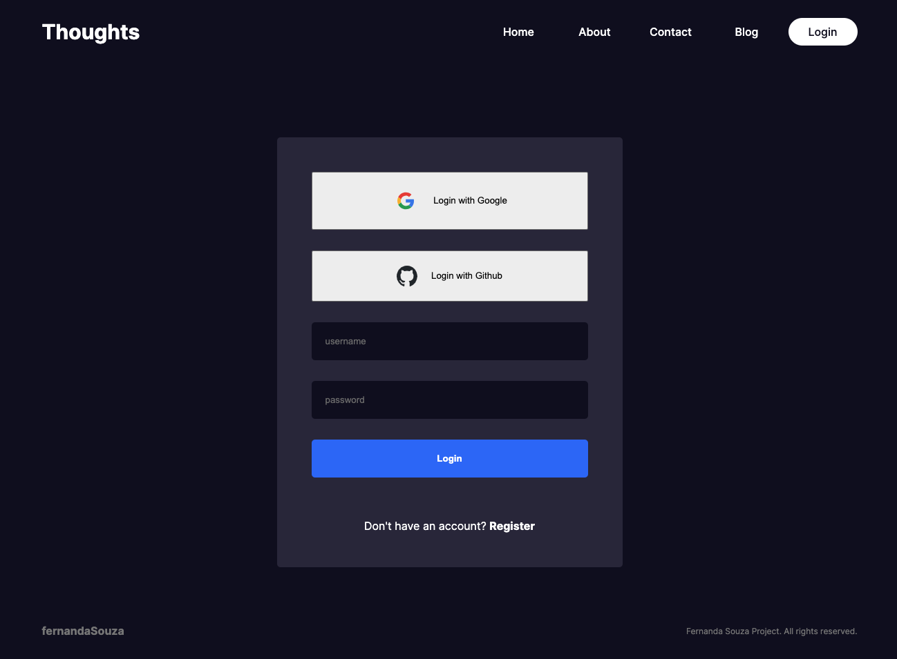
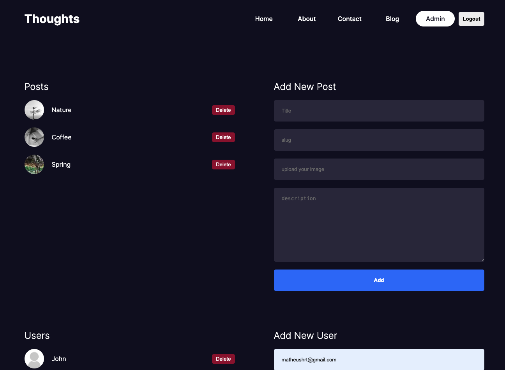
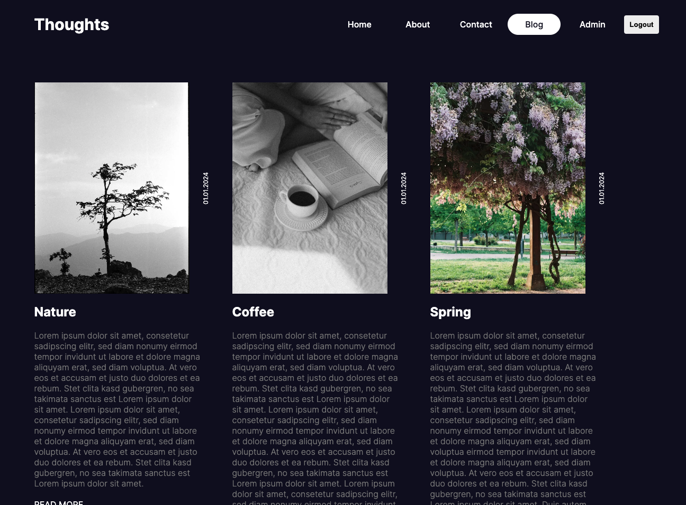

# Next.js Project

## Core Concepts Explored

### App Router/ Folder Structure

In Next.js, the app router simplifies routing by allowing you to create routes with files and folders structure. This makes it easier to manage and scale your application.

### Server-Side Rendering (SSR)

SSR enables pages to be pre-rendered on the server at request time, which improves performance and SEO. It ensures that users receive fully rendered pages, enhancing the overall user experience.

### Client-Side Rendering (CSR)

CSR allows for rendering pages directly in the browser using JavaScript. This is ideal for dynamic interactions and single-page applications where parts of the page update without requiring a full reload.

### Data Fetching

Next.js provides several methods for fetching data, whether at build time, request time, or on the client-side. This flexibility allows you to optimize performance and ensure your app always displays the latest data.

### API Routes

With Next.js, you can easily create API endpoints within your application. These endpoints are great for handling backend logic, such as form submissions and database interactions, without needing a separate server.

### Server Actions and Authentication

Implementing server actions and authentication in Next.js enhances security and user management. Server actions handle sensitive operations securely, while robust authentication mechanisms ensure only authorized users can access certain features.

## Additional Features

I've also implemented login with social media platforms like GitHub and Google, making the authentication process seamless and user-friendly.

## Project Link

Check out my project [here](#), and feel free to explore the codebase!

## Demo

